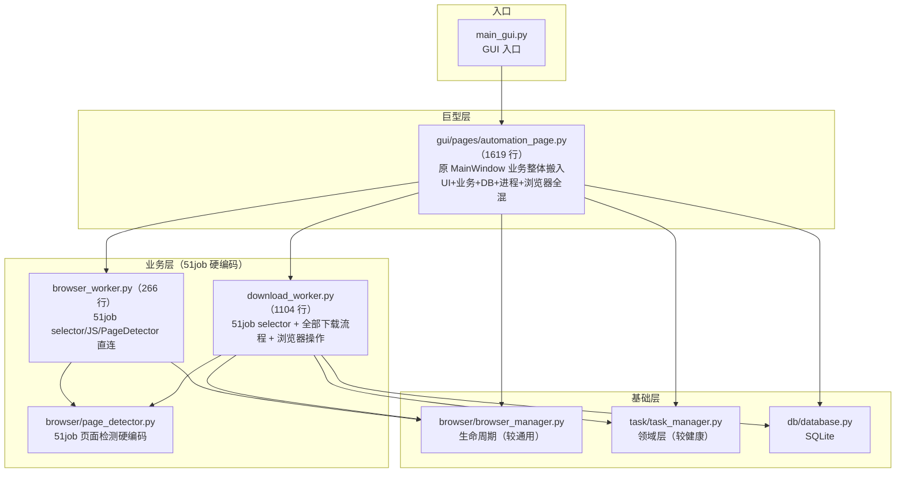
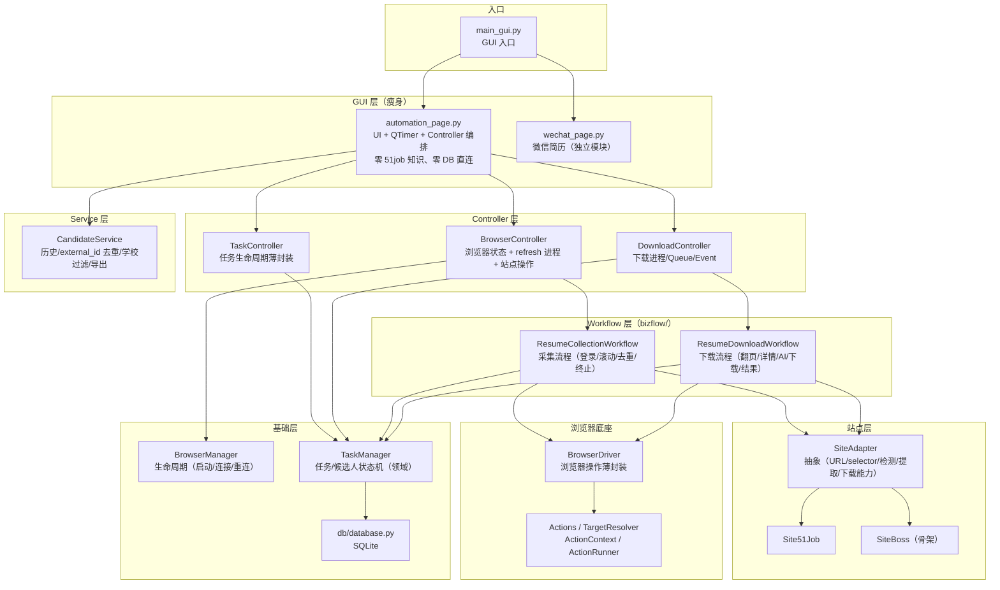

# 林林专属助手 - 架构说明

> 本文档记录浏览器自动化重构（Phase 1 ~ 4B）后的系统架构。
> 分支：`codex/browser-actions-refactor`

## 1. 改造前架构



### 改造前的问题

| 问题 | 表现 |
|---|---|
| 页面是"大杂烩" | automation_page 同时做 UI、业务判断、multiprocessing、DB、浏览器、AI 编排 |
| 51job 知识泄漏 | browser_worker / download_worker / page_detector 全硬编码 `.item.virtual_list` 等 selector |
| 页面直连 DB | `self.db.get_task()` 等散落各处 |
| 下载流程不可复用 | download_worker 1104 行，翻页/详情/AI/下载全耦合 |
| 浏览器操作无抽象 | `page.evaluate(JS)` 直接写在业务里 |

## 2. 改造后架构



## 3. 分层职责

### GUI 层（automation_page.py）

页面只做四件事：
- **用户交互**（按钮/表格/下拉）
- **UI 状态**（按钮显隐、进度条、状态标签）
- **QTimer 调度**（`check_worker_status` 纯调度器：无任务不空转、poll 单消费、统一 `_reset_task_ui` 清理）
- **Controller 编排**（调用四个 Controller，消费返回结果）

页面不再知道：PageDetector、51job selector/JS、`page.evaluate`、`multiprocessing`、DB、AI 细节。

### Controller 层（协调者，不写业务判断）

| Controller | 职责 | 不负责 |
|---|---|---|
| **BrowserController** | 页面侧 BrowserManager 生命周期、refresh 进程/队列、站点操作（switch_job/go_to_page/登录检测） | 结果消费、51job 知识 |
| **TaskController** | 薄封装 TaskManager（创建/暂停/恢复/完成/查询）、异步线程生命周期 | 状态机逻辑（留在 TaskManager） |
| **DownloadController** | download 进程/Queue/stop-pause Event、monitor 协调 | TaskManager、结果消费、AI |

### Service 层（数据管理）

**CandidateService**：跨任务候选人历史、external_id 去重、学校过滤（复用 `crawler/school_filter.py` 的 SchoolFilter）、Excel 导出。不碰网页解析/任务状态/AI。

### Workflow 层（bizflow/）

| Workflow | 对应 Worker | 职责 |
|---|---|---|
| **ResumeCollectionWorkflow** | browser_worker（薄壳） | 采集：登录分支/滚动循环/去重/终止条件 |
| **ResumeDownloadWorkflow** | download_worker（86 行薄壳） | 下载：翻页/候选人处理/详情/附件/AI 判断/结果组装 |

Workflow 不依赖：BrowserManager（经回调协作）、Queue/Event（由 Controller 注入）、GUI、DB。

### 站点层（SiteAdapter）

```
SiteAdapter（抽象）
├── URL / selector / 页面检测 / 登录检测
├── 提取（positions / candidates / pagination）
├── 下载能力（has_next_page / go_to_next_page / find_attachment / find_download / extract_resume_text）
└── Site51Job（真实）/ SiteBoss（骨架验证）
```

跨站点复用已验证：同一 `ResumeCollectionWorkflow` 驱动 Site51Job 和 SiteBoss，源码零站点判断。

### 浏览器底座（BrowserDriver / Actions）

- **BrowserDriver**：Playwright 薄封装（goto/click/fill/wait/extract/scroll/expect_popup/expect_download 等），只管"在浏览器里做什么"
- **Actions**：8 个原子动作（Eval/Extract/Click/Fill/Scroll/Wait/Navigate/Screenshot）+ TargetResolver（逻辑名→selector）+ ActionContext + ActionRunner

### 基础层（未动）

- **BrowserManager**：生命周期（启动/CDP 连接/健康检查/重连），Worker 壳持有
- **TaskManager**：任务/候选人状态机（领域逻辑完整，未动）
- **Database**：SQLite 5 表（含 wechat_resume_records）

## 4. 业务链路

### 采集链路

```
GUI 刷新 → BrowserController → browser_worker（薄壳）
    → ResumeCollectionWorkflow → Site51Job → BrowserDriver → Playwright → 候选人
    → CandidateService（历史过滤）→ 表格
```

### 下载链路

```
GUI 下载 → DownloadController → download_worker（86 行壳）
    → ResumeDownloadWorkflow → Site51Job + BrowserDriver → 真实 PDF
    → TaskManager（状态/结果）→ CandidateService（导出）
```

## 5. 改造量化对比

| 维度 | 改造前 | 改造后 |
|---|---|---|
| download_worker.py | 1104 行（51job+流程+浏览器全混） | **86 行薄壳** |
| browser_worker.py | 266 行（51job 硬编码） | **薄壳** |
| automation_page 51job 知识 | PageDetector/selector/JS 直连 | **0** |
| 页面 DB 直连（Task） | `self.db.get_task` 等 12 处 | **0** |
| 下载进程/Event 归属 | 页面持有 | **DownloadController** |
| 站点复用 | 无（51job 专属） | **SiteAdapter + Workflow 跨站点** |
| 真实回归 | — | 张婉婷 PDF **704627 字节逐字节一致** |

## 6. 目录结构（重构后）

```
resume-agent/
├── main_gui.py / main.py        # 入口
├── browser_worker.py            # 采集 Worker 壳（生命周期 + Workflow 调用）
├── download_worker.py           # 下载 Worker 壳（86 行）
├── requirements/                # base / pyqt5 / pyqt6 拆分
├── build_gui_pyqt6.spec         # PyQt6 onedir（→ 林林专属助手-PyQt6/）
├── build_gui_pyqt5.spec         # PyQt5 onedir（→ 林林专属助手-PyQt5/）
├── build_pyqt6.bat / build_pyqt5.bat  # 双版本打包入口
├── browser/
│   ├── browser_manager.py       # 生命周期
│   ├── page_detector.py         # 51job 检测（逐步迁入 SiteAdapter）
│   └── actions/                 # BrowserDriver / Actions / Resolver / Runner
├── sites/
│   ├── base.py                  # SiteAdapter 抽象
│   ├── site_51job.py            # 51job 站点能力（真实）
│   └── site_boss.py             # BOSS 骨架（跨站点验证）
├── bizflow/
│   ├── resume_collection.py     # 采集工作流
│   └── resume_download.py       # 下载工作流（含 evaluate_resume）
├── gui/
│   ├── qt_compat.py             # Qt 绑定兼容层（QT_BINDING + 枚举别名 + HighDpi/exec）
│   ├── controllers/             # Browser / Task / Download Controller
│   ├── services/                # CandidateService / JobService
│   ├── pages/                   # automation_page / wechat_page
│   └── threads/                 # BrowserMonitorThread
├── task/                        # TaskManager（领域层）
├── crawler/                     # SchoolFilter 等（领域服务）
├── db/                          # SQLite
└── wechat/                      # 微信简历（独立）
```

## 7. 说明与待办

- **`bizflow/` 命名**：原 `workflow/` 与 PyInstaller `hook-workflow.py` 冲突导致打包失败，已重命名规避
- **双 Qt 兼容**：`gui/qt_compat.py` 统一 PyQt5/PyQt6 差异，业务代码一套、零 Qt 版本判断；`QT_BINDING` 显式选择绑定（未设置自动探测优先 PyQt6）；打包用两个隔离 venv + 双 spec + 双 build bat
- **wechat 模块独立**：不参与浏览器重构，保持文件目录方案
- **AI 边界**：未抽 AIService，`evaluate_resume` 保持独立函数，Workflow 内为明确步骤
- **待办（Phase 5 方向）**：
  - CandidateService / TaskService 深化（如需）
  - download_worker 更多真实回归（多页 / AI 拒绝 / 暂停恢复 / 任务恢复）
  - automation_page 最终瘦身
